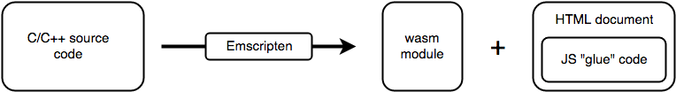
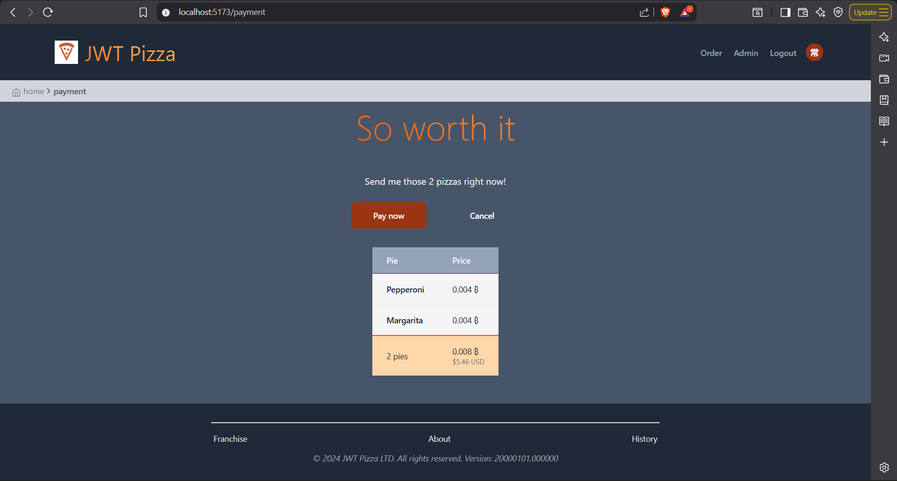

# Curiosity Report

# Web assembly

### What is Web Assembly?
Web assembly is a mini compiler for source languages like C, C++, and Rust, and allows such languages to be run on a web browser at near native speeds. It is also accepted by all major browsers! \
To read more, visit this link:
https://developer.mozilla.org/en-US/docs/WebAssembly
Because it's fascinating :)


### Why Web Assembly?
WebAssembly allows you to stick apps made in other languages into the browser. On top of being awesome, it's also easy to use and clears a lot of hoops you would otherwise have to jump through for the same functionality.

Here is a summary of the benefits:

	- Convert low level memory models such as C++ to wasm modules 
	- Runs safely inside the browser sandbox
	- Deploy it like a static asset (CDN-friendly)
	- Avoid server-side native execution risks

Instead of:

	- Running C on a server (needs Docker, OS dependencies, security hardening)
	- Rewriting it in JavaScript
You can:

	- Compile once
	- Ship the binary
	- Run securely in the browser
	
---

### How to use Web Assembly?
In the case of an app written in C, we need to: 
1. Provide a C file
2. Use an assembler (such as Emscripten) to convert to a wasm module 
3. Then glue it to an HTML file using JavaScript. \

 \
Source: https://developer.mozilla.org/en-US/docs/WebAssembly/Guides/Concepts


    Fun Side Note: In the future they plan to be able to support languages with garbage-collected memory models.
    

------

### WebAssembly Demo

Our pizzas are awesome, but some of our customers want to buy with USD, so let's add a C program that calculates the price
of our pizzas in USD.

We want our C price fixer to sit in the browser, read in values, and then display the USD price to the webpage.
    
    Note: We don't want the C program to be messing with our database at all!

##### Step 0 — Prerequisites
You need:
Git and Python (3.x) \
Check:

```
git --version
python --version
```

If those work, you’re good.

---
##### Step 1 — Install Emscripten
Clone the SDK

```
git clone https://github.com/emscripten-core/emsdk.git
cd emsdk
```

Install latest version

```
emsdk install latest
emsdk activate latest
```

Activate it in your shell

```
source ./emsdk_env.sh
```

Now test:
```
emcc -v
```
If you see version info, you’re ready.

---
##### Step 2 — Create the C prices program
Create a new file called `prices.c` and paste in the following code:

```
#include <emscripten/emscripten.h>

EMSCRIPTEN_KEEPALIVE
double btc_to_usd(double btc_amount) {

    // Hardcoded BTC price, can be any value, doesn't matter!
    double btc_price_usd = 65000.0;

    return btc_amount * btc_price_usd;
}
```

and then compile it:
```
emcc pricing.c -o pricing.js \
  -s EXPORTED_FUNCTIONS='["_btc_to_usd"]' \
  -s EXPORTED_RUNTIME_METHODS='["ccall"]'
  ```
---
##### Step 3 — Gluing to the frontend
Move the 'pricing.js' and 'pricing.wasm' to jwt-pizza/public, so that react can see them.

Move to payment.tsx and follow these steps:
1. Load the script in your React component:
```
React.useEffect(() => {
  const script = document.createElement('script');
  script.src = '/pricing.js';
  document.body.appendChild(script);
  return () => document.body.removeChild(script);
}, []);
```
2. Call your C function after WebAssembly initializes:
```
React.useEffect(() => {
  const convert = () => {
    const usd = window.Module.ccall('btc_to_usd', 'number', ['number'], [totalBTC]);
    setTotalUSD(usd);
  };

  if (window.Module) {
    if (window.Module.calledRun) convert();
    else window.Module.onRuntimeInitialized = convert;
  }
}, [totalBTC]);
```
3. Display the result in the UI (put this inside the td tag where you want to display the price):
```
{totalUSD !== null ? `$${totalUSD.toFixed(2)} USD` : 'Loading conversion…'}
```

Once you are done, it should look something like this:\
 

    Note: I did have some trouble with the C file not loading in the right order, and it took some tinkering with AI.

### Conclusion
In this project, we used WebAssembly to run a C program directly in the browser, converting Bitcoin prices to USD. Although it is a small part of our website, it demonstrates the potential for much more. Using the WebAssembly approach preserved high-performance computation and also put into practice QA and DevOps principles. We were able to ship a module with no server complexity, delivering a reliable and secure front-end for our customers!
