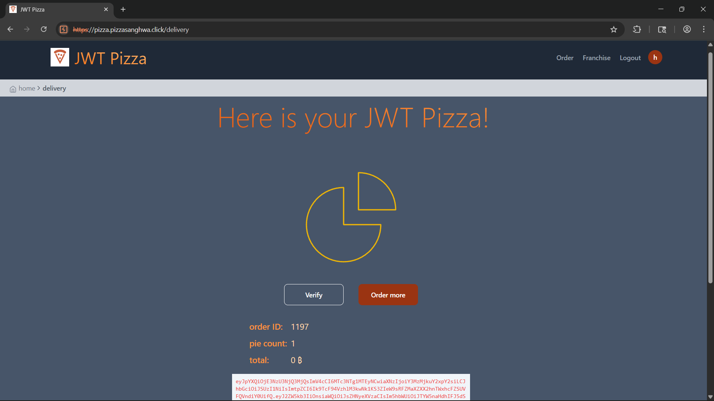
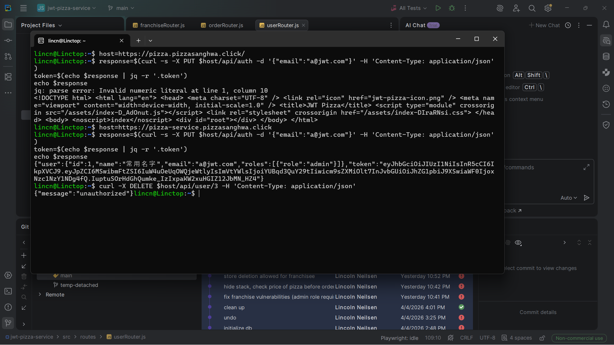
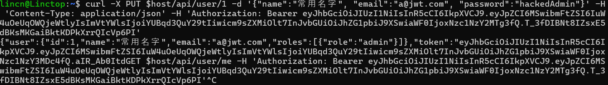
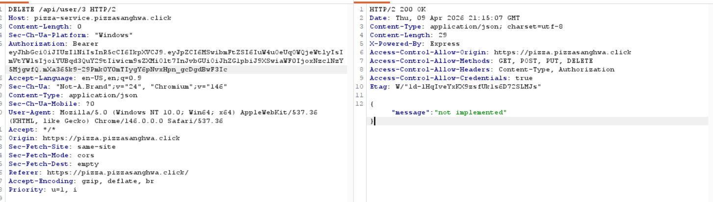
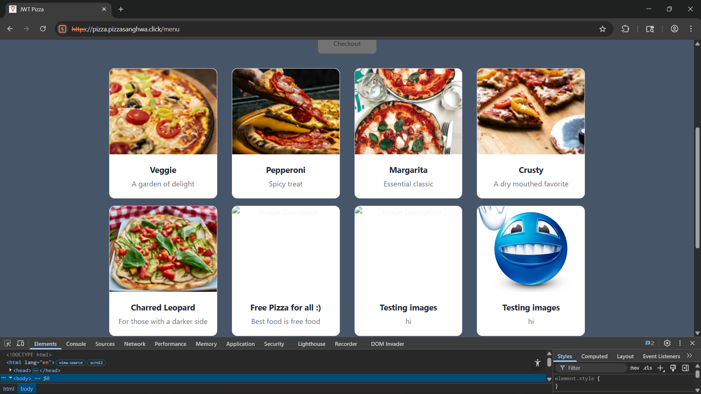
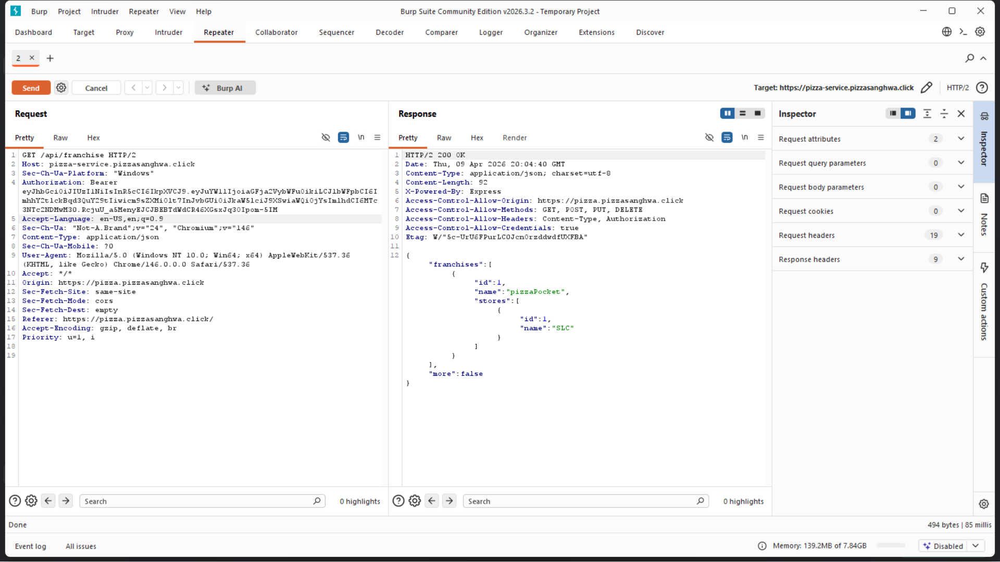
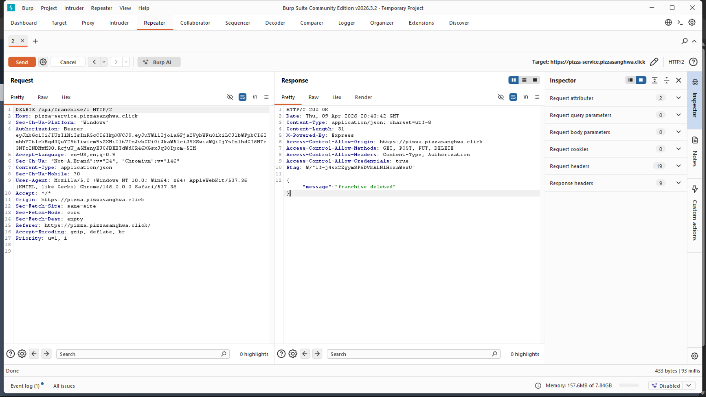
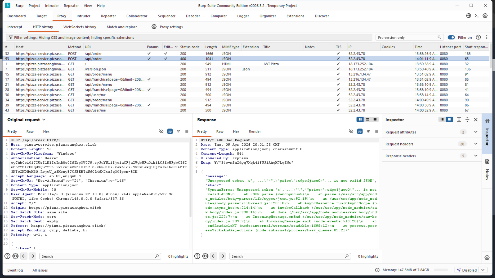

### PizzaStealer

| Item           | Result                                 |
| -------------- |----------------------------------------|
| Date           | April 8, 2026                          |
| Target         | https://pizza.pizzasanghwa.click                 |
| Classification | Broken Access Control                  |
| Severity       | 2                                      |
| Description    | Can freely manipulate prices of pizzas |
| Images         |           |
| Corrections    | Double check pricing on server side.   |

### PizzaSneaker
| Item           | Result                                                                                                                                                                                                                                                                                                                                                                                                                                                                                     |
| -------------- |--------------------------------------------------------------------------------------------------------------------------------------------------------------------------------------------------------------------------------------------------------------------------------------------------------------------------------------------------------------------------------------------------------------------------------------------------------------------------------------------|
| Date           | April 8, 2026                                                                                                                                                                                                                                                                                                                                                                                                                                                                              |
| Target         | https://pizza.pizzasanghwa.click                                                                                                                                                                                                                                                                                                                                                                                                                                                                     |
| Classification | Broken Access Control                                                                                                                                                                                                                                                                                                                                                                                                                                                                      |
| Severity       | 4                                                                                                                                                                                                                                                                                                                                                                                                                                                                                          |
| Description    | No password needed to login to the pizza service backend. Works for admin users as well. By using a PUT request to /api/auth with only an email, an attacker can gain access to any account. From here I was able to change the password of the admin, and the information of any user. Unfortunately I was unable to exploit the get and delete endpoint for users because it was not implemented :(. I was still able to make new menu items with any price and image. And franchises :) |
| Images         |                                                                                                                                                                                                                                                                                                                                                   |
| Corrections    | Ensure the server validates passwords for all authentication requests.                                                                                                                                                                                                                                                                                                                                                                                                                     |

### PizzaPeeper
|  Item           | Result                                                                                                          |
|  -------------- |-----------------------------------------------------------------------------------------------------------------|
|  Date           | April 8, 2026                                                                                                   |
|  Target         | https://pizza.pizzasanghwa.click                                                                                         |
|  Classification | Broken Access Control                                                                                           |
|  Severity       | 2                                                                                                               |
|  Description    | Unauthorized users can view franchise details and store revenue by accessing /api/franchise/:id directly.       |
|  Images         |                                                                             |
|  Corrections    | Implement proper authorization checks on all franchise-related API endpoints to ensure only owners see details. |

### FranchiseCrusher
|  Item           | Result                                        |
|  -------------- |-----------------------------------------------|
|  Date           | April 8, 2026                                 |
|  Target         | https://pizza.pizzasanghwa.click                      |
|  Classification | Broken Access Control                         |
|  Severity       | 2                                             |
|  Description    | Unauthorized users can delete franchise by hitting delete/api/franchise/:id directly. |
|  Images         |           |
|  Corrections    | Implement proper authorization checks on all franchise-related API endpoints. |

### PizzaStackStalker
|  Item           | Result                                         |
|  -------------- |------------------------------------------------|
|  Date           | April 8, 2026                                  |
|  Target         | https://pizza.pizzasanghwa.click                         |
|  Classification | Broken Access Control                          |
|  Severity       | 1                                              |
|  Description    | Unauthorized users can see the stack response. |
|  Images         |                       |
|  Corrections    | Ensure safe error reporting.                   |
